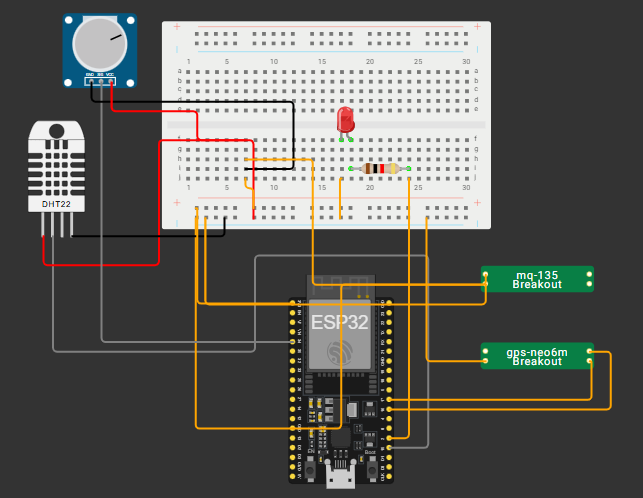

# Sistema de Monitoramento Ambiental

Este projeto tem como objetivo o **monitoramento de variáveis ambientais** (temperatura, umidade, solo, qualidade do ar) por meio de um dispositivo ESP32 com sensores, envio dos dados para uma API Flask e exibição em um painel web com **gráficos, histórico e alertas**.

---

## 👥 Integrantes

| Nome Completo               | RM       |
|-----------------------------|----------|
| Pedro Henrique Lima Santos  | 558243   |
| Vitor Gomes Martins         | 558244   |
| Leonardo Pimentel Santos    | 557541   |

## 📸 Ilustração do circuito

  
*Exemplo de fluxo: ESP32 → Node-RED → API Flask → Armazenamento + Interface Web*

---

## 🧾 Descrição da Solução

- Dispositivo **ESP32** com sensores lê os dados do ambiente em tempo real.
- Os dados são enviados via **Node-RED**.
- A API salva os logs com timestamp, local (latitude/longitude), imagem associada ao alerta.
- A interface web mostra:
  - Painel de gráficos dos dados.
  - Página de histórico com paginação.
  - Página com os logs registrados, com imagens.

---

## 🛠️ Estrutura do Projeto

```bash
/
├── app/                           # Código principal da aplicação Flask
│   ├── __pycache__/               # Arquivos de cache do Python
│   ├── static/                    # Arquivos estáticos (JS e CSS)
│   │   ├── css/                   # Arquivos CSS
│   │   │   └── styles.css         # Estilização do sistema
│   │   ├── javascript/            # Arquivos JS
│   │   │   ├── graph.js           # Exibição de gráficos
│   │   │   ├── history.js         # Gerenciamento de histórico
│   │   │   └── script.js          # Dashboard de logs
│   ├── templates/                 # Arquivos HTML
├── data/                          # Arquivos JSON e dados
│   └── log.json                   # Logs recebidos do ESP32
├── esp32/                         # Informações sobre o ESP32
│   ├── circuit.png                # Imagem do circuito
│   └── main.ino                   # Código do ESP32
├── mqtt_bridge.py                 # Bridge para conexão MQTT
├── nodered.json                   # Fluxo exportado do Node-RED
├── readme.md                      # Documentação do projeto
├── requirements.txt               # Dependências do projeto
└── run.py                         # Arquivo principal de execução do sistema
```

## 📡 Fluxo Node-RED - Recebimento e Armazenamento de Dados

O fluxo criado no Node-RED realiza o processo de **recebimento, tratamento e armazenamento de dados** enviados pelo ESP32 via MQTT. Abaixo está a descrição detalhada de cada etapa do fluxo:

[ESP32] → MQTT (HiveMQ) → Node-RED → Adiciona timestamp → Lê log.json → Atualiza array JSON → Salva no arquivo

---

### 🔁 Etapas do fluxo

MQTT IN (esp32/dados)
├─ Nó: mqtt in
├─ Descrição: Escuta a topic esp32/dados no broker HiveMQ. Recebe dados no formato JSON enviados pelo ESP32.
└─ QoS: 1

Adicionar timestamp
├─ Nó: function
├─ Descrição: Adiciona o campo timestamp ao payload no formato ISO (ex: 2025-06-09T14:30:00.000Z).
└─ Define também o caminho do arquivo: data/log.json

Leitura do arquivo log.json
├─ Nó: file in
└─ Descrição: Lê o conteúdo atual do arquivo log.json para obter os logs armazenados anteriormente.

Adicionar ao array existente
├─ Nó: function
├─ Descrição: Converte o conteúdo lido em array. Caso esteja vazio ou inválido, inicializa como array vazio.
└─ Adiciona o novo dado com timestamp ao final do array.

Salvar no arquivo log.json
├─ Nó: file
└─ Descrição: Salva o novo conteúdo no arquivo log.json, sobrescrevendo com o array atualizado.

---

### 🌐 Configuração do Broker MQTT

Broker:        HiveMQ (broker público)
Endereço:      broker.hivemq.com
Porta:         1883
Tópico:        esp32/dados
Protocolo:     MQTT v3.1.1

---

### 🗂 Arquivo gerado

Caminho:    data/log.json  
Formato:    JSON  
Conteúdo:   Array de objetos contendo os dados do ESP32 com timestamps  

> 💡 Este fluxo permite armazenar com segurança e em tempo real os dados recebidos do ESP32, garantindo que possam ser utilizados posteriormente pela API Flask e exibidos na interface web.

---

## 🚀 Como Executar o Projeto

### Pré-requisitos

- [Node.js](https://nodejs.org/) 
- [Git](https://git-scm.com/)
- Editor de código (como o [VS Code](https://code.visualstudio.com/))

### 1. Clone o repositório
```bash
git clone https://github.com/30Lima/The-Guardians-eye-iot.git
cd The-Guardians-eye-iot
```

### 2. Instale as dependências
```bash
pip install flask
pip install paho-mqtt
pip install requests
npm install -g node-red
```

### 3. Rode o node-RED
```bash
node-red
```
> Lembre-se de sempre executar os arquivos em terminais diferentes.


### 4. Ainda no node-RED, importe o arquivo JSON 


> Imagem para auxílio de download


### 4.1 Acesse o canto superior direito do node-RED


### 4.2 Clique em "Importar"


### 4.2 Selecione o arquivo JSON que você baixou (ou somente cole o arquivo no campo solicitado)


### 5. Acesse o sistema do ESP32 na plataforma wowki
```bash
https://wokwi.com/projects/433090140394028033
```
### 6. Execute o sistema do ESP32


### 7. No terminal do vscode (ou a sua IDE), execute
```bash
python run.py
```

### 8. Acesse o localhost (foi exibido no seu terminal) e veja o sistema funcionando
> Exemplo de localhost - http://127.0.0.1:5000

### Imagens do sistema:
> DashBoard de Logs do ESP32


> Gráfico de temperatura


> Gráfico de umidade


> Gráfico de umidade do solo


> Gráfico de qualidade do ar


> Histórico de logs com filtragem por data e exportação para csv


© 2025 MontClio. Todos os direitos reservados.
